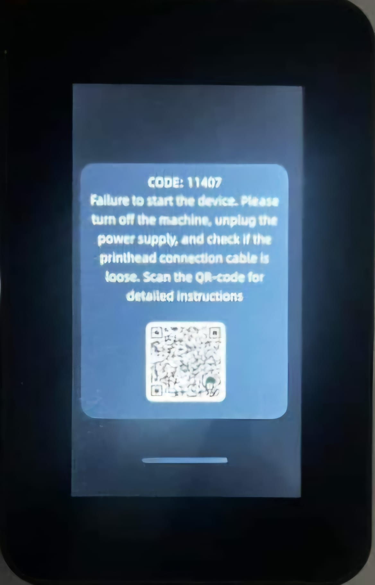

# Kobra3-Firmware - RECOVERING PRINTER WHEN THINGS GO SOUTH
Kobra3 Firmware information and How to recover Kobra3 Firmware via USB

> [!WARNING]
> # USE AT YOUR OWN RISK. I TAKE NO RESPONSABILITY OF WHAT YOU DO WITH BELOW INFORMATION
> # Latest version tested : 2.3.3.9

In ordre to recover the printer, first way to solve the issue is to reinstall the stock firmware.

For this, you need to download firmware from anycubic cloud :

**2.3.3.2** : https://cdn.cloud-universe.anycubic.com/attachment/1823263180633739265_l5fmjrss.swu

**2.3.3.9** : https://cdn.cloud-universe.anycubic.com/attachment/1826082241870905345_sz3boql8.swu

Once you have downloaded the firmware, you need to rename the downloaded file to "update.swu"

Then you need to create a folder at the root of your USB drive and copy the update.swu in it.

**2.3.3.2** : the folder must be called "**update**"

**2.3.3.9** : the folder must be called "**aGVscF9zb3Nf**"

Boot the printer and wait. This can take a long time (more than 5 minutes).

After the printer fix, you must reconfigure wifi and do a factory reset via the menu.

.