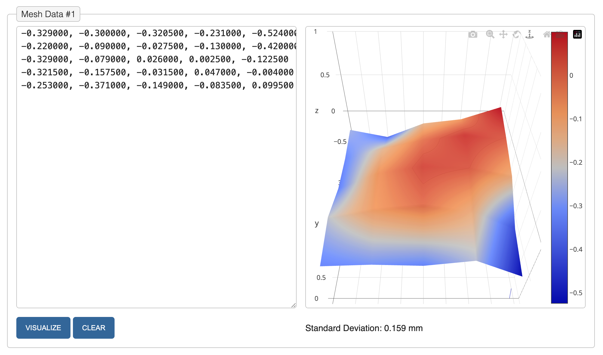

# 3D Printer Auto Bed Leveling Mesh Visualizer (Now part of firmware tweak which start a webserver and display current mesh)

This web page is a conversion from PHP version made by:

[mcaskill]: https://github.com/mcaskill/3d-printer-bed-mesh-visualizer

How does the bed mesh configuration in printer.cfg work : https://www.klipper3d.org/Bed_Mesh.html

> [!WARNING]
> # PUTTING WRONG INFO IN PRINTER.CFG FILE CAN PREVENT THE PRINTER TO BOOT
> # IF PRINTER STUCK AT BOOT WITH ERROR ABOUT PRINT HEAD DISCONNECTED, YOU MAY NEED TO FIX PRINTER BY INJECTING CORRECT PRINTER.CFG VIA FIRMWARE UPDATE METHOD OF THIS REPOSITORY

.

You need to take the bed mesh data from the file here : 

/userdata/app/gk/printer_mutable.cfg

You then copy the points data and format it as required (replace \n and put results on 5 lines).

Click visualize and that is it.

A simple Web page to render a 3D mesh of bed mesh results using [Plotly.js].

The visualizer is based on the [ChillRain's visualizer][ChillRain].

The site icon is Cube 6 from [Iconmonstr].

[ChillRain]:  https://i.chillrain.com/index.php/3d-printer-auto-bed-leveling-mesh-visualizer/
[Iconmonstr]: https://iconmonstr.com/cube-6-svg/
[Marlin G29]: https://marlinfw.org/docs/gcode/G029-abl-bilinear.html
[Plotly.js]:  https://plotly.com/javascript/
